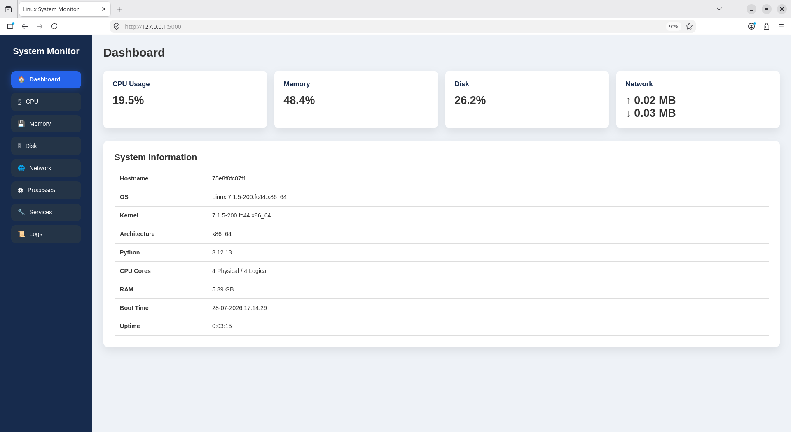
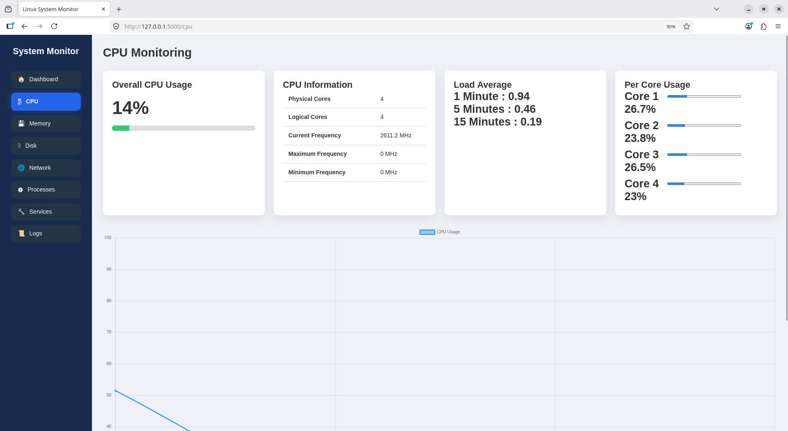
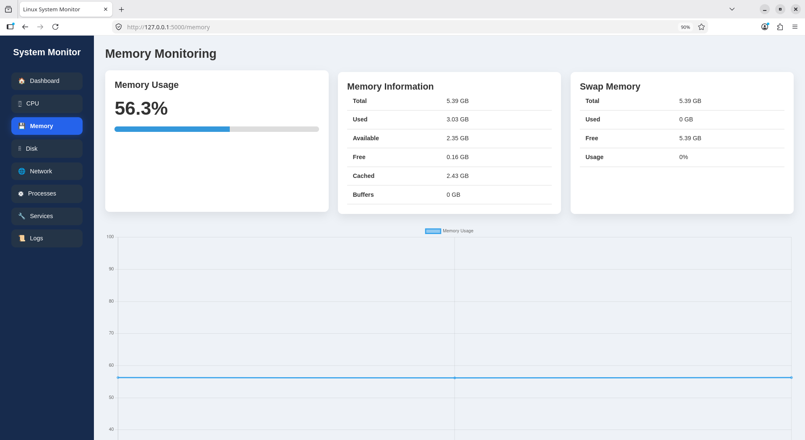
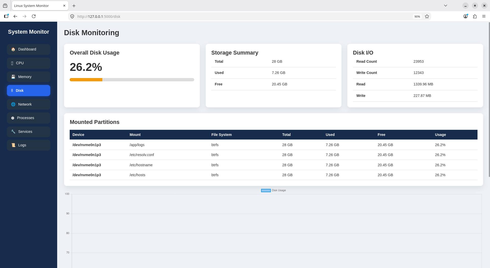
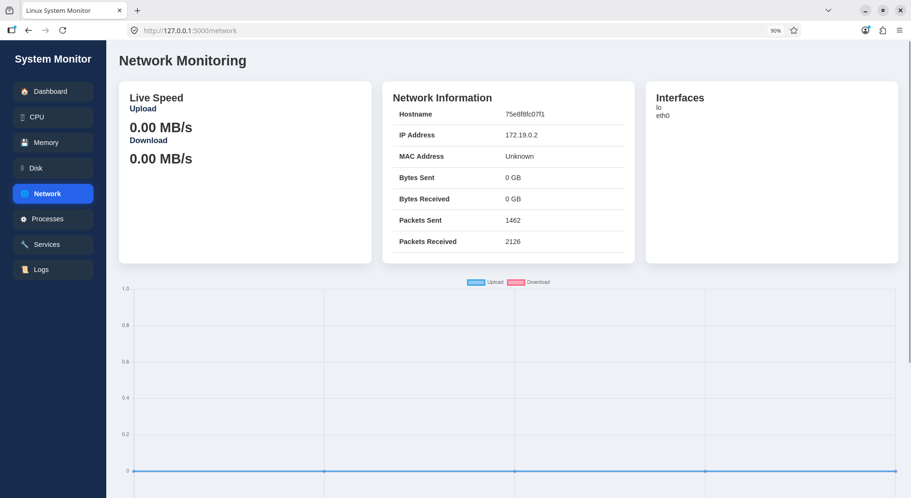
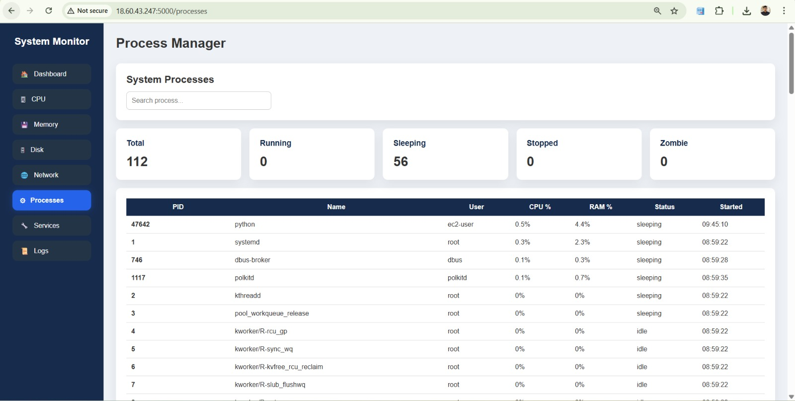
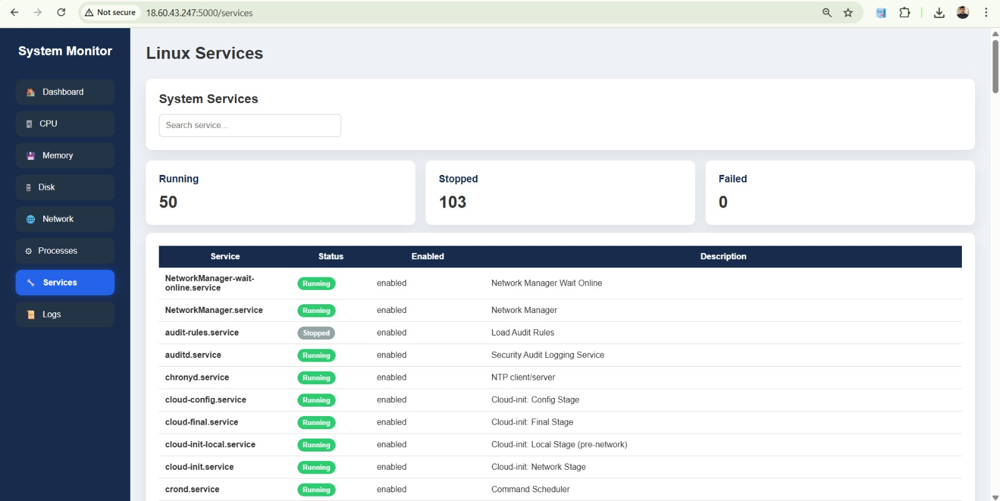
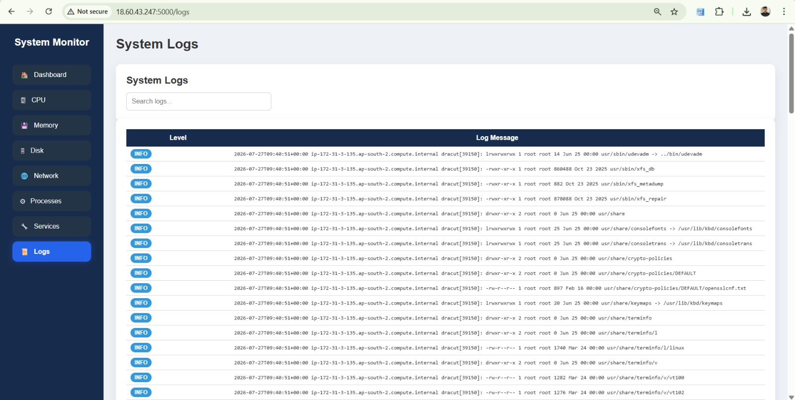

# Linux System Monitoring Dashboard with Docker, Nginx, HTTPS, SELinux & Fail2Ban


---

# Linux System Monitoring Dashboard

A production-style Linux System Monitoring Dashboard built using **Python Flask** running inside a **Docker Container**, secured behind an **Nginx Reverse Proxy** with **HTTPS**, **SELinux**, **Firewalld**, **Fail2Ban**, and **real-time log monitoring**.

This project demonstrates how to deploy and secure a containerized web application on a Red Hat/Fedora based Linux system following industry best practices.

The dashboard provides real-time monitoring of CPU, Memory, Disk, Network, Running Processes, Services, and System Logs through a responsive web interface.

---

# Project Architecture

```
                   User Browser
                        │
                    HTTPS (443)
                        │
                  ┌────────────┐
                  │   NGINX    │
                  │ReverseProxy│
                  └─────┬──────┘
                        │
               HTTP localhost:5000
                        │
                Docker Container
                        │
                 Flask Application
                        │
        ┌───────────────┼───────────────┐
        │               │               │
     psutil         systemctl        journalctl
        │               │               │
        └───────────────┼───────────────┘
                        │
                  Linux Operating System
```

---

# Features

### System Monitoring

- Real-time CPU Usage
- Memory Usage
- Disk Usage
- Network Statistics
- Running Processes
- Linux Services
- System Information
- System Logs

---

### Docker

- Containerized Flask Application
- Docker Compose Support
- Health Checks
- Persistent Project Structure

---

### Web Server

- Nginx Reverse Proxy
- HTTP → HTTPS Redirection
- SSL Certificate
- Reverse Proxy Configuration

---

### Security

- HTTPS Enabled
- Self Signed SSL Certificate
- SELinux Enabled
- Firewalld Configured
- Fail2Ban Protection
- Security Headers
- Nginx Hardening

---

### Logging

- Docker Logs
- Nginx Access Logs
- Nginx Error Logs
- Live Log Monitoring
- journalctl Integration

---

# Technologies Used

- Python 3.12
- Flask
- HTML
- CSS
- JavaScript
- Docker
- Docker Compose
- Nginx
- OpenSSL
- Firewalld
- SELinux
- Fail2Ban
- journalctl
- Git
- GitHub
- Fedora Linux (RHEL Based)

---

# Project Structure

```
system-monitoring-app/
│
├── app.py
├── config.py
├── Dockerfile
├── docker-compose.yml
├── requirements.txt
│
├── routes/
│
├── services/
│
├── templates/
│
├── static/
│   ├── css/
│   ├── js/
│   └── images/
│
├── logs/
│
├── nginx/
│   ├── ssl/
│   └── conf.d/
│
├── log_monitor/
│
└── README.md
```

---

# Dashboard Preview

## Dashboard

> 

---

## CPU Monitoring

> 

---

## Memory Monitoring

> 

---

## Disk Monitoring

> 

---

## Network Monitoring

> 

---

## Running Processes

> 

---

## Services

> 

---

## Logs

> 

---
# Installation Guide

This project was built and tested on **Fedora Linux (RHEL Based)**.

---

# Prerequisites

- Fedora / RHEL Linux
- Git
- Docker
- Docker Compose
- Python 3
- OpenSSL
- Nginx
- Firewalld
- SELinux
- Fail2Ban

---
# 🚀 Initial Project Setup (Development Mode)

This section explains how to run the Flask application directly on Fedora before Dockerizing it.

---

## Step 1: Update the System

```bash
sudo dnf update -y
sudo dnf upgrade -y
```

---

## Step 2: Install Python

```bash
sudo dnf install python3 python3-pip -y
```

Verify installation

```bash
python3 --version
pip3 --version
```

---

## Step 3: Clone the Repository

```bash
git clone https://github.com/innovateabhi/advance-system-monitoring-app.git
```

```bash
cd system-monitoring-app-rhel
```

---

## Step 4: Create a Virtual Environment

```bash
python3 -m venv venv
```

Activate it

```bash
source venv/bin/activate
```

Your terminal should now show

```
(venv)
```

---

## Step 5: Install Python Dependencies

```bash
pip install --upgrade pip
```

```bash
pip install -r requirements.txt
```

---

## Step 6: Verify Project Structure

```
system-monitoring-app-rhel/
│
├── app.py
├── config.py
├── requirements.txt
├── Dockerfile
├── docker-compose.yml
├── routes/
├── services/
├── templates/
├── static/
├── logs/
├── nginx/
├── security/
└── log_monitor/
```

---

## Step 7: Run the Flask Application

```bash
python app.py
```

Expected output

```
* Running on http://127.0.0.1:5000
```

Open your browser

```
http://localhost:5000
```

The Linux System Monitoring Dashboard should now appear.

---

## Step 8: Stop the Server

Press

```
CTRL + C
```

Deactivate virtual environment

```bash
deactivate
```

---

# 🐳 Containerizing the Application

After confirming that the Flask application works correctly in development mode, we can now containerize it using Docker.

---

# Step 9 — Install Docker

```bash
sudo dnf install docker -y
```

Enable Docker.

```bash
sudo systemctl enable docker
```

Start Docker.

```bash
sudo systemctl start docker
```

Check Docker status.

```bash
sudo systemctl status docker
```

Verify Docker installation.

```bash
docker --version
```

---

# Step 10 — Install Docker Compose

```bash
sudo dnf install docker-compose -y
```

Verify installation.

```bash
docker compose version
```

or

```bash
docker-compose --version
```

---

# Step 11 — Add User to Docker Group

```bash
sudo usermod -aG docker $USER
```

Refresh the group.

```bash
newgrp docker
```

Verify.

```bash
docker ps
```

---

# Step 12 — Build Docker Image

```bash
docker compose build
```

or

```bash
docker compose up --build
```

---

# Step 13 — Start the Application

Run in detached mode.

```bash
docker compose up -d
```

Verify running container.

```bash
docker ps
```

Expected output:

```
system-monitor
Up
Healthy
```

---

# Step 14 — Verify Docker Logs

```bash
docker logs system-monitor
```

Live logs.

```bash
docker logs -f system-monitor
```

---

# Step 15 — Test Flask Application

Open the browser.

```
http://localhost:5000
```

or

```bash
curl http://127.0.0.1:5000
```

You should receive the HTML page of the dashboard.

---

# Step 16 — Install Nginx

```bash
sudo dnf install nginx -y
```

Enable the service.

```bash
sudo systemctl enable nginx
```

Start Nginx.

```bash
sudo systemctl start nginx
```

Verify status.

```bash
sudo systemctl status nginx
```

---

# Step 17 — Configure Reverse Proxy

Create the configuration file.

```bash
sudo nano /etc/nginx/conf.d/system-monitor.conf
```

Reload configuration.

```bash
sudo nginx -t
```

Restart Nginx.

```bash
sudo systemctl restart nginx
```

---

# Step 18 — Configure Firewall

Allow HTTP.

```bash
sudo firewall-cmd --permanent --add-service=http
```

Allow HTTPS.

```bash
sudo firewall-cmd --permanent --add-service=https
```

Reload firewall.

```bash
sudo firewall-cmd --reload
```

Verify.

```bash
sudo firewall-cmd --list-all
```

---

# Step 19 — Generate SSL Certificate

Create SSL directory.

```bash
sudo mkdir -p /etc/nginx/ssl
```

Generate a self-signed certificate.

```bash
sudo openssl req -x509 -nodes -days 365 \
-newkey rsa:4096 \
-keyout /etc/nginx/ssl/system-monitor.key \
-out /etc/nginx/ssl/system-monitor.crt
```

Test Nginx configuration.

```bash
sudo nginx -t
```

Restart.

```bash
sudo systemctl restart nginx
```

---

# Step 20 — Access the Secure Dashboard

Open the browser.

```
https://localhost
```

Accept the browser warning (self-signed certificate).

The dashboard should now load over **HTTPS**.

---

# Step 21 — Verify Reverse Proxy

```bash
curl http://127.0.0.1:5000
```

```bash
curl https://localhost
```

Both should return the Flask application's HTML page.

---

# Useful Docker Commands

Build image.

```bash
docker compose build
```

Start containers.

```bash
docker compose up -d
```

Stop containers.

```bash
docker compose down
```

Restart.

```bash
docker compose restart
```

View containers.

```bash
docker ps
```

View logs.

```bash
docker logs system-monitor
```

Follow logs.

```bash
docker logs -f system-monitor
```

Remove containers.

```bash
docker compose down --volumes
```

Rebuild completely.

```bash
docker compose up --build -d
```

---

# Verify Everything

Docker

```bash
docker ps
```

Nginx

```bash
sudo systemctl status nginx
```

Firewall

```bash
sudo firewall-cmd --list-all
```

HTTPS

```
https://localhost
```

Application

```
Dashboard opens successfully.
```

---
# Security Hardening

This project follows multiple Linux security best practices to secure both the web server and the Docker container.

---

# 1. Run Docker Container as Non-Root User

Running containers as root is a security risk. A compromised application could potentially gain elevated privileges on the host system.

Create a dedicated application user inside the Docker image.

Example Dockerfile:

```dockerfile
RUN addgroup --system appgroup && \
    adduser --system --ingroup appgroup appuser

USER appuser
```

Rebuild the image.

```bash
docker compose down
docker compose up --build -d
```

Verify the running user.

```bash
docker exec -it system-monitor whoami
```

Expected Output

```
appuser
```

---

# 2. Configure Nginx Reverse Proxy

Install Nginx.

```bash
sudo dnf install nginx -y
```

Enable the service.

```bash
sudo systemctl enable nginx
```

Start the service.

```bash
sudo systemctl start nginx
```

Verify.

```bash
sudo systemctl status nginx
```

Create the configuration.

```bash
sudo nano /etc/nginx/conf.d/system-monitor.conf
```

Validate configuration.

```bash
sudo nginx -t
```

Restart.

```bash
sudo systemctl restart nginx
```

Verify.

```bash
curl http://localhost
```

---

# 3. Enable HTTPS

Generate SSL directory.

```bash
sudo mkdir -p /etc/nginx/ssl
```

Generate self-signed certificate.

```bash
sudo openssl req -x509 \
-newkey rsa:4096 \
-keyout /etc/nginx/ssl/system-monitor.key \
-out /etc/nginx/ssl/system-monitor.crt \
-days 365 \
-nodes
```

Verify certificate.

```bash
ls /etc/nginx/ssl
```

Test configuration.

```bash
sudo nginx -t
```

Restart.

```bash
sudo systemctl restart nginx
```

Open

```
https://localhost
```

---

# 4. Nginx Hardening

The following security improvements were implemented.

## Disable Server Tokens

Hide Nginx version.

```nginx
server_tokens off;
```

---

## Limit Request Body

```nginx
client_max_body_size 10M;
```

---

## Reduce Timeout

```nginx
client_body_timeout 10s;
client_header_timeout 10s;
send_timeout 10s;
keepalive_timeout 15s;
```

---

## Security Headers

```nginx
add_header X-Frame-Options "SAMEORIGIN" always;
add_header X-Content-Type-Options "nosniff" always;
add_header X-XSS-Protection "1; mode=block" always;
add_header Referrer-Policy "strict-origin-when-cross-origin" always;
add_header Content-Security-Policy "default-src 'self';" always;
```

---

## Limit HTTP Requests

```nginx
limit_req_zone $binary_remote_addr zone=api_limit:10m rate=10r/s;
```

Apply inside location block.

```nginx
limit_req zone=api_limit burst=20 nodelay;
```

---

## Restart Nginx

```bash
sudo nginx -t
sudo systemctl restart nginx
```

---

# 5. Configure Firewalld

Enable firewall.

```bash
sudo systemctl enable firewalld
```

Start.

```bash
sudo systemctl start firewalld
```

Allow HTTP.

```bash
sudo firewall-cmd --permanent --add-service=http
```

Allow HTTPS.

```bash
sudo firewall-cmd --permanent --add-service=https
```

Reload.

```bash
sudo firewall-cmd --reload
```

Verify.

```bash
sudo firewall-cmd --list-all
```

---

# 6. Enable SELinux

Check status.

```bash
getenforce
```

Expected

```
Enforcing
```

Allow Nginx to connect to the Docker application.

```bash
sudo setsebool -P httpd_can_network_connect 1
```

Verify.

```bash
getsebool httpd_can_network_connect
```

Expected

```
httpd_can_network_connect --> on
```

Check file contexts.

```bash
ls -Zd .
```

---

# 7. Docker Log Monitoring

View container logs.

```bash
docker logs system-monitor
```

Follow logs.

```bash
docker logs -f system-monitor
```

View last 100 lines.

```bash
docker logs --tail 100 system-monitor
```

Check running containers.

```bash
docker ps
```

---

# 8. Nginx Log Monitoring

Access log.

```bash
sudo tail -f /var/log/nginx/access.log
```

Error log.

```bash
sudo tail -f /var/log/nginx/error.log
```

View last 50 lines.

```bash
sudo tail -50 /var/log/nginx/error.log
```

---

# 9. System Journal Monitoring

View recent logs.

```bash
journalctl -xe
```

Monitor live logs.

```bash
journalctl -f
```

Monitor Nginx.

```bash
journalctl -u nginx -f
```

Monitor Docker.

```bash
journalctl -u docker -f
```

---

# 10. Install Fail2Ban

Install.

```bash
sudo dnf install fail2ban -y
```

Enable service.

```bash
sudo systemctl enable fail2ban
```

Create configuration.

```bash
sudo nano /etc/fail2ban/jail.local
```

Start Fail2Ban.

```bash
sudo systemctl restart fail2ban
```

Verify.

```bash
sudo systemctl status fail2ban
```

Check active jails.

```bash
sudo fail2ban-client status
```

View SSH jail.

```bash
sudo fail2ban-client status sshd
```

---

# 11. Verify Security Configuration

Check Docker container.

```bash
docker ps
```

Check Nginx.

```bash
sudo nginx -t
```

Check HTTPS.

```bash
curl -k https://localhost
```

Check Firewall.

```bash
sudo firewall-cmd --list-all
```

Check SELinux.

```bash
getenforce
```

Check Fail2Ban.

```bash
sudo fail2ban-client status
```

---

# Security Features Implemented

| Feature | Status |
|----------|--------|
| Docker Containerization | ✅ |
| Docker Non-Root User | ✅ |
| Nginx Reverse Proxy | ✅ |
| HTTPS (SSL/TLS) | ✅ |
| HTTP to HTTPS Redirect | ✅ |
| Security Headers | ✅ |
| Request Rate Limiting | ✅ |
| Firewalld | ✅ |
| SELinux Enforcing | ✅ |
| Docker Log Monitoring | ✅ |
| Nginx Log Monitoring | ✅ |
| Journal Monitoring | ✅ |
| Fail2Ban | ✅ |

---
# Usage

Once the application is running successfully, open your browser and visit:

```
https://localhost
```

> **Note:** Since a self-signed SSL certificate is used, your browser will display a security warning. Click **Advanced** → **Proceed to localhost (unsafe)** to continue.

The dashboard provides the following monitoring modules:

- 🏠 Dashboard Overview
- 🖥 CPU Monitoring
- 💾 Memory Monitoring
- 🗄 Disk Monitoring
- 🌐 Network Monitoring
- ⚙ Running Processes
- 🔧 Linux Services
- 📜 System Logs

---

# Testing

## Test Docker Container

```bash
docker ps
```

---

## Test Flask Application

```bash
curl http://127.0.0.1:5000
```

---

## Test Nginx

```bash
curl http://localhost
```

---

## Test HTTPS

```bash
curl -k https://localhost
```

---

## Test Firewall

```bash
sudo firewall-cmd --list-all
```

---

## Test SELinux

```bash
getenforce
```

Expected Output

```
Enforcing
```

---

## Test Docker Logs

```bash
docker logs system-monitor
```

---

## Test Nginx Logs

```bash
sudo tail -f /var/log/nginx/access.log
```

---

## Test Fail2Ban

```bash
sudo fail2ban-client status
```

---

## Test Running Services

```bash
systemctl status nginx
systemctl status docker
systemctl status fail2ban
```

---

# Troubleshooting

## Docker Container Restarting Continuously

Check logs.

```bash
docker logs system-monitor
```

Rebuild the application.

```bash
docker compose down
docker compose up --build -d
```

---

## Permission Denied on app.py

If Docker shows:

```
python: can't open file '/app/app.py': Permission denied
```

Ensure the file has the correct permissions.

```bash
chmod +x app.py
```

If SELinux is enforcing, verify the required policy is enabled.

```bash
sudo setsebool -P httpd_can_network_connect 1
```

---

## 502 Bad Gateway

Verify Docker is running.

```bash
docker ps
```

Check whether Flask is listening on port 5000.

```bash
curl http://127.0.0.1:5000
```

Validate Nginx configuration.

```bash
sudo nginx -t
```

Restart Nginx.

```bash
sudo systemctl restart nginx
```

---

## HTTPS Not Working

Verify SSL files.

```bash
ls /etc/nginx/ssl
```

Check configuration.

```bash
sudo nginx -t
```

Restart Nginx.

```bash
sudo systemctl restart nginx
```

---

## Fail2Ban Not Starting

Check service status.

```bash
sudo systemctl status fail2ban
```

Validate configuration.

```bash
sudo fail2ban-client -d
```

Review logs.

```bash
journalctl -u fail2ban
```

---

## SELinux Blocking Nginx

Check audit logs.

```bash
sudo ausearch -m AVC
```

Allow Nginx to connect to Docker.

```bash
sudo setsebool -P httpd_can_network_connect 1
```

---

# Project Workflow

```
Update Fedora
      │
      ▼
Install Git
      │
      ▼
Clone Repository
      │
      ▼
Install Docker
      │
      ▼
Build Docker Image
      │
      ▼
Run Flask Container
      │
      ▼
Install Nginx
      │
      ▼
Configure Reverse Proxy
      │
      ▼
Enable HTTPS
      │
      ▼
Configure Firewalld
      │
      ▼
Enable SELinux
      │
      ▼
Configure Log Monitoring
      │
      ▼
Install Fail2Ban
      │
      ▼
Secure Production-Style Deployment
```

---


# Learning Outcomes

By completing this project, you will gain hands-on experience with:

- Linux System Administration
- Docker Containerization
- Docker Compose
- Python Flask Development
- Nginx Reverse Proxy Configuration
- HTTPS and SSL/TLS
- Firewalld Management
- SELinux Policy Configuration
- Fail2Ban Intrusion Prevention
- Docker and Nginx Log Monitoring
- Linux Service Management
- Production Web Server Hardening
- Secure Application Deployment
- Git and GitHub Workflow

---

# License

This project is licensed under the **MIT License**.

Feel free to use, modify, and distribute this project for educational and personal purposes.

---

# Acknowledgements

This project was built for learning and demonstrating:

- Linux Administration
- Web Server Security
- Docker Containerization
- Secure Deployment Practices
- Production-style Infrastructure
- Open Source Technologies

Special thanks to the open-source communities behind:

- Fedora Linux
- Docker
- Flask
- Nginx
- Python
- Fail2Ban
- SELinux
- Git

---

